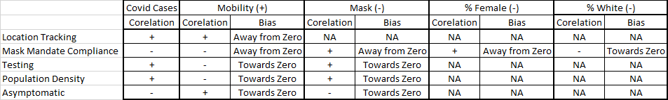

```{r, warning=FALSE, echo=FALSE, message=FALSE, include=FALSE}
#Install packages and load libraries 

#Pastecs for nice, quick summary features of our datasets. 
#install.packages("pastecs", repos = "http://cran.us.r-project.org")
#install.packages("jtools", repos = "http://cran.us.r-project.org")
#install.packages("png")
library("readxl")
library("tidyverse")
library("openxlsx")
library(dplyr)
library(zoo)
library(grid)
library(gridExtra)
library(corrplot)
library(jtools)
library(tidyverse)
library(lmtest)
library(sandwich)
library(stargazer)
library(stats)
library(png)
knitr::opts_chunk$set(echo = TRUE, warning = FALSE)
```

```{r}
mobility_report <- read.csv("~/w203_lab2_group1/data/raw/mobility_report.csv")
covid_cases <- read.csv("~/w203_lab2_group1/data/raw/covid_cases.csv")
df <- read.csv("~/w203_lab2_group1/data/cleaned/df.csv")
```

## Introduction

It has been over a year since the initial outbreak of COVID-19 in the US. During this year, many states have adopted various policies to slow down the spread of the pandemic. For example, in New York city, Gov. Andrew Cuomo shut indoor on March 16, 2020. Many companies also started to operate in telecommuting mode. As a result, people’s mobility pattern is very different from the pre COVID-19 period. This presents an opportunity for studying the impact of these mobility changes on the spreading of COVID-19.

We think this is an interesting research question now because some states are starting to gradually revert some policies. For example, as of 3/19, indoor dining can increase to 50% capacity in New York City. The research result of the effects of change of mobility on new covid cases would help people and states make decisions on whether to increase their retail and recreation activity.
We propose exploring a causal relationship between the mobility, public mask mandate and demographics within a state and COVID-19 cases. Formally, our primary research question is: 

How much does a percentage change in mobility impact the percentage change in new COVID-19 cases within a given state, given a 2 week lag period? 

We choose to use 2 weeks between mobility & mask mandate and new COVID-19 cases based on the current CDC guidelines [@CDC] suggesting an individual is likely to incubate the disease 2-14 days after initial symptoms appear (which could be up to 10 days after initial infection).Thus 2 weeks after (i.e. days 14 to 21) mobility/mask mandate best covers this period of 12 to 24 days. 

## Model Building Process

### Data Sources

* New York Times COVID-19 Cases Data [@NYT]: A series of data files with cumulative counts of coronavirus cases in the United States, at the state and county level, over time.
* COVID-19 US State Policy Database [@CUSP]: A database of state policy responses to the pandemic, compiled by researchers at the Boston University School of Public Health.
* COVID-19 Community Mobility Report [@Google]: A Google dataset that includes state-level measurements of individual mobility
* The American Community Survey [@USCensus]: A product from the US Census Bureau that contains state-level demographics and other indicators of general interest.

### Choosing the variables

In this section we will define the dependent variable and independent variables, as well as our reasons to choose them. 

#### Choosing the time period

We decide to use mobility variables during the week June 28th, 2020 to July 4th, 2020 and the new covid cases variable with a 2 week lag - July 18th, 2020 to Jult

#### Dependent variable

##### percent_change_in_week_over_week_covid_cases (July 18th - 24th)

Percentage change in new COVID cases, comparing the number of new cases from Sunday 07/19/20 - Saturday 07/25/20 vs. Sunday 07/12/20 - Saturday 07/18/20.

The time period of the dependent variable is 2 weeks lagged from the mobility variable. The time period of the dependent variable is 2 weeks lagged from the mobility variable. We choose the 2 weeks lagging period based on the CDC suggestion that an individual is likely to incubate the disease 2-14 days after initial symptoms appear (which could be up to 10 days after initial infection).

We chose to use this time period for the following reasons

* This time period captures the return towards baseline mobility after the initial lock down dip (quarantine fatigue) which is an interesting time period to study (Figure 2) 
* This is a week in which 31 states did not have public face mask mandates vs 20 states did, and therefore is interesting time period to study the effects of public face mask mandates on slowing down the spread of COVID-19.
* Is a counter to the seasonal nature of the disease, i.e. weather plays less of a role in transmission during this summer time period which helps our causal question.
* It's early enough in the pandemic that we'd expect a much lower proportion of the population to have contracted the disease already and develop antibodies, which gives us a clearer picture of our causal question.

Our method of choosing percent_change and the lag between change in covid cases and change in mobility is akin to the “differenced panels” approach on async video 11.14. Similar to “differenced panels approach”. By taking the difference of percent in new covid cases, we can reduce some impacts of the confounding variables.

#### Independent variables

##### percent_change_in_week_over_week_mobility_retail_and_recreation (Sat,Sun,M...F)

Seven variables, each a percentage point change in median mobility (compared to baseline) for Retail & Recreation for the week of Sunday 06/28/20 - Saturday 07/04/20  vs Sunday 06/21/20 - Saturday 06/27/20 for each day of the week. Sunday is only compared to Sunday, etc.

Since we have no indication of how to weight these values based on what the real baseline number is, we can’t simply average all 7 days. For example, a -10 percent change of mobility on Monday is very different from a -10 percent change of mobility on Saturday since the baseline number of people for Saturday is much higher. Therefore we decide to keep these variables separate. 

##### public_mask_mandate_flag (In place as of June 28th)

Flag for whether or not a public face mask mandate was in place for the state as of June 28th (i.e. the majority of the week of July 4th, our primary week of interest for change in mobility)


##### percent_female (2019)

American Community Survey (2019) estimate of state’s percentage of female residents.

This study [@HBS] suggests that "women are much more likely than men to view COVID-19 as a severe health problem. They are also more willing to wear face masks and follow other public health recommendations to prevent the spread of the virus countries."

Therefore we decide to include this variable as a control variable.

##### percent_white (2019)

American Community Survey (2019) estimate of state’s percentage of white residents.

This article [@MayoClinic] suggests that "Research increasingly shows that racial and ethnic minorities are disproportionately affected by coronavirus disease 2019 (COVID-19) in the United States."

Therefore we decide to include this variable as a control variable.

##### percent_65_and_older (2019)

American Community Survey (2019) estimate of state’s percentage of residents 65 or older (66 or older at time of analysis).

CDC suggests that "Older adults are At greater risk of requiring hospitalization or dying if diagnosed with COVID-19" [@CDC2].

Therefore we think that states with a high percentage of older adult population could have lower mobility due to the fear of getting COVID-19 and therefore, lead to lower COVID-19 cases.We decide to include this variable as a control variable.

##### percent_24_and_younger (2019)

American Community Survey (2019) estimate of state’s percentage of residents 24 or younger (25 or younger at time of analysis) .

According to the news, some college students have shown reckless behavior with respect to social distancing [@InsideHigherEd]. 

Therefore we decide to include this variable as a control variable.

### Choosing the mobility variable

```{r, warning=FALSE, echo=FALSE}
get_plots <- function(mobility, covid_cases, state_var) {

mobility_report <- mobility

covid_cases$date <- as.Date(covid_cases$date)
# Add new cases
covid_cases <- covid_cases %>% group_by(fips) %>% mutate(new_cases=c(NA, diff(cases)))
  
mob_ny <- mobility_report %>% mutate(date=as.Date(date)) %>% filter(sub_region_1==state_var)  %>% filter(sub_region_2=='')
mob_ny_smooth <- mob_ny %>% mutate(
  retail_and_recreation=rollmean(x=retail_and_recreation_percent_change_from_baseline, 7, na.pad=TRUE, align="right"),
  grocery_and_rx=rollmean(x=grocery_and_pharmacy_percent_change_from_baseline, 7, na.pad=TRUE, align="right"),
  transit=rollmean(x=transit_stations_percent_change_from_baseline, 7, na.pad=TRUE, align="right"),
  park=rollmean(x=parks_percent_change_from_baseline, 7, na.pad=TRUE, align="right"),
  residence=rollmean(x=residential_percent_change_from_baseline, 7, na.pad=TRUE, align="right"),
  workplaces=rollmean(x=workplaces_percent_change_from_baseline, 7, na.pad=TRUE, align="right"),
)

covid_ny <- covid_cases %>% filter(state==state_var) %>% mutate(new_cases_smooth=rollmean(x=new_cases, 7, na.pad=TRUE, align="right"))
joined <- left_join(covid_ny, mob_ny_smooth, by='date')

retail_plot <- joined %>% ggplot(aes(x=date)) + geom_line(aes(y=retail_and_recreation)) + 
  geom_line(aes(y=new_cases_smooth / 1000), color='green') + scale_x_date(date_labels = "%m") + xlab("month")

grocery_plot <- joined %>% ggplot(aes(x=date)) + geom_line(aes(y=grocery_and_rx)) + 
  geom_line(aes(y=new_cases_smooth / 1000), color='green') + scale_x_date(date_labels = "%m") + xlab("month")

transit_plot <- joined %>% ggplot(aes(x=date)) + geom_line(aes(y=transit)) + 
  geom_line(aes(y=new_cases_smooth / 1000), color='green') + scale_x_date(date_labels = "%m") + xlab("month")

park_plot <- joined %>% ggplot(aes(x=date)) + geom_line(aes(y=park)) + 
  geom_line(aes(y=new_cases_smooth / 1000), color='green') + scale_x_date(date_labels = "%m") + xlab("month")

resid_plot <- joined %>% ggplot(aes(x=date)) + geom_line(aes(y=residence)) + 
  geom_line(aes(y=new_cases_smooth / 1000), color='green') + scale_x_date(date_labels = "%m") + xlab("month")

work_plot <- joined %>% ggplot(aes(x=date)) + geom_line(aes(y=workplaces)) + 
  geom_line(aes(y=new_cases_smooth / 1000), color='green') + scale_x_date(date_labels = "%m") + xlab("month")

plots <- grid.arrange(
  retail_plot,
  grocery_plot,
  transit_plot,
  park_plot,
  resid_plot,
  work_plot,
  nrow = 3,
  top = "Figure 2: Moblity and New Covid Cases in California\n",
  bottom = "Mobility(Black): percent\nNew Covid Cases(Green): 1000 cases"
)

return(plots)
}
```

In this section, we will show the process of choosing the mobility variable. The two charts show (1) the correlation plot between different variables and (2) the time series plot show the relationship between different mobility variables by time.

```{r, warning=FALSE, echo=FALSE}
M <- cor(mobility_report[, c(10: 15)] %>% rename(retail_and_recreation=retail_and_recreation_percent_change_from_baseline, grocery_and_rx=grocery_and_pharmacy_percent_change_from_baseline, parks=parks_percent_change_from_baseline, transit=transit_stations_percent_change_from_baseline, workspaces=workplaces_percent_change_from_baseline, residential= residential_percent_change_from_baseline) %>% drop_na())

corrplot(M, method='circle', title="Figure 1 Mobility variable correlations", mar=c(0,0,1,0))
```

```{r, warning=FALSE, echo=FALSE}
plots <- get_plots(mobility_report, covid_cases, 'California')
```

Figure 1, 2 show that retail, transit and grocery have positive correlation of > 0.70 (figure 2) and they tend to move in the same direction (figure 1). Retail and residential has a negative correlation of -0.75  and they tend to move approximately in the opposite direction.

Since retail mobility is positively correlated with transit and grocery and negatively correlated with residence mobility, we decide to only include one of them as our independent mobility variable. We decide to use retail mobility because we think its practical meaning is the most interesting among all the mobility variables, given the political focus on restaurants and storefronts. We decide not to use workplaces and park mobility variable because (1) park is outdoor and easier to maintain 6-feet social distances, and therefore, we don’t expect change in park mobility will cause change in new covid cases and (2) for workplaces, generally speaking people have less control of whether to go to workplaces or not, and therefore, this variable does not have sufficient practical impact.

Another observation is that there is no clear correlation between any of the mobility variables and new COVID-19 cases. Still, we decide to include mobility as an independent variable to study its combined effects with other independent variables (public mask mandate and demographic variables)

### Examine the control variables

In this section, we will examine the relationship between control variables (public_mask_mandate_flag, percent_female, percent_white, percent_65_and_older, percent_24_and_younger) and the dependent variable (percent_change_in_week_over_week_covid_cases) for the study time period (July 18th - 24th).

#### Public mask mandate

Looking the boxplot for percent change in COVID-19 cases group by public mask mandate variable for the 51 states (Figure 3), we see that there is a slight higher mean states without public mask mandate, but the variable is also pretty high to draw any conclusion from this plot. We decide to include this control variable and further examine its coefficient and p-value.

``` {r, warning=FALSE, echo=FALSE}
df %>% ggplot(aes(x=public_mask_mandate_flag, group=public_mask_mandate_flag, y=p1_p2_percent_change_in_cases)) + geom_boxplot() + ylab("% change in covid cases") + xlab("State-wide Public mask mandate (0 means no mandate)") + ggtitle("Figure 3: \n change in covid cases with/without public mask mandate")
```

#### Demongraphics variables

Here is a combined scatter plot for the four demographics variables we are interested in (percent_female, percent_white, percent_65_and_older, percent_24_and_younger). The scatter plots don't show a clear pattern of the linear relationship just by these control variables themselves. Nonetheless, we decide to include these variables in the model specification to study further.

```{r, warning=FALSE, echo=FALSE, message=FALSE}
percent_female <- df %>% ggplot(aes(x=percent_female, y=p1_p2_percent_change_in_cases)) + geom_point() + stat_smooth(se=TRUE) + xlab("% female population") + ylab("% change in covid cases")
percent_white <- df %>% ggplot(aes(x=percent_white, y=p1_p2_percent_change_in_cases)) + geom_point() + stat_smooth(se=TRUE) +xlab("% white population") + ylab("% change in covid cases")
percent_over_65 <- df %>% ggplot(aes(x=percent_over_65, y=p1_p2_percent_change_in_cases)) + geom_point() + stat_smooth(se=TRUE) +xlab("% population over 65 years old ") + ylab("% change in covid cases")
percent_under_24 <- df %>% ggplot(aes(x=percent_under_24, y=p1_p2_percent_change_in_cases)) + geom_point() + stat_smooth(se=TRUE) +xlab("% population under 24 years old ") + ylab("% change in covid cases")

grid.arrange(
  percent_female, percent_white, percent_over_65, percent_under_24, nrow = 2,
  bottom = "Figure 4: \nRelationship between demongraphics control variables and % change in covid cases\n"
)
```

### Modeling Goal

Our modeling goal is explanatory. Primarily, we are interested in the causal relationship between mobility change in retail and recreation of the week of 06/28/2020 and the change of new COVID-19 cases 2 weeks later. Secondarily, we are interested in the casual described above, with the control of public mask mandate and demographic variables as control variables.

We are only studying the casual relationship within the chosen time period and not planning to extend any conclusion beyond the original time period.

### Casual Theory

#### Increase in retail and recreation mobility causes increase in new covid cases

From CDC:
“The virus that causes COVID-19 most commonly spreads from person to person by respiratory droplets during close physical contact (within 6 feet). The virus can sometimes spread from person to person by small droplets or virus particles that linger in the air for minutes to hours.”

Based on this, our casual theory is that an increase in retail and recreation mobility would result in an increase in the number of people that each person is in contact with, and therefore, increase the chances of each individual infected by covid, and finally, result in an increase in new covid cases.

#### Public Facemask Mandate causes decrease in new covid cases

COVID-19 is airborne and spread by respiratory droplets which enter through the nose and mouth. Wearing a mask will help prevent the spread of these droplets into the air. It is possible for someone to spread the virus even if they do not have symptoms [@Olmsted].

Based on this, our casual theory is that public facemask mandate causes a decrease in new covid cases, so long as mobility is constant. In other words, public mask mandates moderate the impact mobility has on new COVID-19 cases. 

### Model Specifications

#### Linear Model

precent_change_in_week_over_week_covid_cases ~ precent_change_in_week_over_week_mobility_retail_and_recreation (Sunday, Monday, .. , Saturday)

#### Model Two

change_in_week_over_week_covid_cases ~ percent_change_in_week_over_week_mobility_retail_and_recreation (Sunday, Monday, .. , Saturday) + public_mask_mandate_flag

#### Model Three

percent_change_in_week_over_week_covid_cases ~ percent_change_in_week_over_week_mobility_retail_and_recreation (Sunday, Monday, .. , Saturday) + public_mask_mandate_flag + percent_white + percent_female + percent_under_24 + percent_over_65

## Regression Table

We chose to use classical standard errors in our regression model and coefficient tests because in our case, they were larger than robust standard errors (more conservative). As will be discussed in our assessment of the classical linear model assumptions, we have not found evidence of heteroscedastic variance of errors. We chose to use a general linear F-test for nested models to determine if there is a statistically significant improvement in our F-statistic between reduced and full models. This gives us a statistically testable comparison of our models based on the error sum of squares (SSE) for each. We prefer the comparison of the SSE statistic to R-squared because it is in the same unit as the dependent variable, whereas R-squared is a percentage term, and thus SSE is more easily interpretable in both absolute and relative terms.  For assessing the significance of the coefficients of our predictors and for conducting our F-test, we chose to use an alpha level of 0.05 due to the popularity of this threshold value and since we do not have a preference, given our limited background in the study of COVID-19 case analysis.

```{r, warning=FALSE, echo=FALSE}
#Import cleaned dataframe
df <- read.csv(file = "~/w203_lab2_group1/data/cleaned/df.csv")
```
```{r, warning=FALSE, echo=FALSE}
#Short Model
short_model <- lm(p1_p2_percent_change_in_cases ~ Sunday_retail + Monday_retail + Tuesday_retail + Wednesday_retail + Thursday_retail + Friday_retail + Saturday_retail, data = df)

#Add robust standard errors
cov_short <- vcovHC(short_model, type = "HC")
short.robust.se <- sqrt(diag(cov_short))

#Medium Model
medium_model <- lm(p1_p2_percent_change_in_cases ~ Sunday_retail + Monday_retail + Tuesday_retail + Wednesday_retail + Thursday_retail + Friday_retail + Saturday_retail + public_mask_mandate_flag, data = df)
#summary(medium_model)

#Add robust standard errors
cov_medium <- vcovHC(medium_model, type = "HC")
medium.robust.se <- sqrt(diag(cov_medium))

#Full Model
full_model <- lm(p1_p2_percent_change_in_cases ~ Sunday_retail + Monday_retail + Tuesday_retail + Wednesday_retail + Thursday_retail + Friday_retail + Saturday_retail + public_mask_mandate_flag + percent_female + percent_white + percent_under_24 + percent_over_65,data = df)

#Add robust standard errors
cov_full <- vcovHC(full_model, type = "HC")
full.robust.se <- sqrt(diag(cov_full))
```
```{r, warning=FALSE, echo=FALSE}
#Build regression table with Stargazer (with classical standard errors)
stargazer(
  short_model, medium_model, full_model, 
  type = 'text', align = TRUE, title="Regression Results", 
  dep.var.labels=c("Percent Change in New Cases"),
  covariate.labels=c("Sunday (Retail)","Monday (Retail)", "Tuesday (Retail)", 
                     "Wednesday (Retail)", "Thursday (Retail)", "Friday (Retail)", 
                     "Saturday (Retail)", "Public Mask Mandate Flag", 
                     "Percent Female", "Percent White", "Percent Under 24", 
                     "Percent Over 65")
)
```
```{r}
#Run f.tests medium/short models
anova(medium_model, short_model, test = "F")
```

```{r}
#Run f.test for full/medium models
anova(full_model, medium_model, test = "F")
```

The results of our regression analysis in the results table indicate that, generally, changes in mobility (as proxied by recreation and retail) for the weeks of June 28, 2020 to July 4th, 2020 do not explain changes in new COVID-19 cases two weeks later (unless the effect of mobility has been masked by an omitted variable). Model 1 in the regression table above demonstrates that there is not a statistically significant weekday mobility change that explains changes in statewide COVID-19 cases. As a whole, we fail to reject the null hypothesis that Model 1 has a significantly higher F-statistic than an intercept only model (p > 0.05). We also observe that adding a control for a public mask mandate flag in Model 2 does not significantly improve our model compared to Model 1 (we fail to reject the null hypothesis that Model 2 has a statistically different F-statistic than Model 1  since conducting an F-test to compare models 1 and 2 results in a p-value greater than our alpha of 0.05). The public mask mandate variable is not significant at an alpha level of 0.05. 

Interestingly, we see significant improvements in our explanatory model as a whole as measured by a reduction in the sum of squared estimates of errors (also known as RSS) and certain explanatory variables when adding controls for state-level demographic features in Model 3. We reject our null hypothesis that Model 2 and Model 3 have the same F-statistic (since the resulting p-value from the F-test of models 2 and 3 is less than our alpha of 0.05), and conclude that Model 3 is a statistically significant improvement upon Model 2 and an intercept only model (i.e. a regression with no independent variables). 

When controlling for a state’s gender balance (percent female), racial composition (percent white), and age (percent under 24 and percent over 65), we observe that the change in mobility for Thursday (July 2nd compared to June 25th) is statistically significant at an alpha level of 0.05. However, since only one weekday’s mobility change is statistically significant, we do not deem this finding a practically significant finding regarding mobility more generally (for this week long period). Six of seven mobility variables are still not statistically significant. Thus, we conclude that changes in mobility do not explain changes in new COVID-19 cases for this time-period and this model specifically. Mobility may still explain changes in COVID-19 cases in different time periods or if we were able to include all omitted variables discussed later.  

In our Model 3, we observe that the public mask mandate flag is statistically significant (p = 0.04) at an alpha level of 0.05, when controlling for mobility and the aforementioned demographic variables. In our observation period, state’s with a public mask mandate flag in place as of June 28th, 2020 (i.e. the majority of the week that includes the July 4th holiday) saw 14% fewer new COVID-19 cases week-over-week, two weeks after the mobility time period than states with no public mask mandate flag in place, holding mobility and demographics constant. This is both statistically and practically significant. This indicates that the oft-debated mask policies instituted during this time period may be effective at reducing new COVID-19 cases (holding other variables constant), if this observation is not an artifact of omitted variable bias. 

We also observe that percent female (p = 0.03) and percent white (p = 0.002) are statistically significant at an alpha level of 0.05 in our Model 3. A 1 percentage point (ppt) increase in a state’s proportion of female residents was associated with 9% fewer new COVID-19 cases week-over-week, when holding mobility, public mask mandate flag, and other demographic variables constant. This is both statistically and practically significant. Although a state can not simply adjust demographic composition, it is practically significant in helping understand how COVID-19 may impact different genders and/or how different gender groups may adhere to COVID-19 health guidelines. A 1 ppt increase in a state’s proportion of residents who identify as white was associated with 1% fewer new COVID-19 cases week-over-week, when holding mobility, public mask mandate flag, and other demographic variables constant. This coefficient is statistically significant and practically significant. Even though this is our smallest coefficient estimate, the implications of COVID-19 trending differently for different races points to a need for further research in this critical area. 


## Limitations of the Model

```{r test CLM assumption of linear conditional expectation and homoskedasticity, warning=FALSE, echo=FALSE}

# Add columns for predicted values based upon each model
df <- df %>% 
  mutate(model_1_prediction = predict(short_model),
         model_1_residuals = resid(short_model),
         model_2_prediction = predict(medium_model),
         model_2_residuals = resid(medium_model),
         model_3_prediction = predict(full_model), 
         model_3_residuals = resid(full_model))

# Plot the residuals vs the predicted values for the short model
plot_1 <- df %>%  
  ggplot(aes(x = model_1_prediction, y = model_1_residuals)) + 
  geom_point() + stat_smooth() + ggtitle("Model 1 Residual Plot") + xlab("Predictions") + ylab("Residuals") + theme_classic()

# Plot the residuals vs the predicted values for the medium model
plot_2 <- df %>%  
  ggplot(aes(x = model_2_prediction, y = model_2_residuals)) + 
  geom_point() + stat_smooth() + ggtitle("Model 2 Residual Plot") + xlab("Predictions") + ylab("Residuals") + theme_classic()

# Plot the residuals vs the predicted values for the full model
plot_3 <- df %>%  
  ggplot(aes(x = model_3_prediction, y = model_3_residuals)) + 
  geom_point() + stat_smooth() + ggtitle("Model 3 Residual Plot") + xlab("Predictions") + ylab("Residuals") + theme_classic()


```


#### I.I.D.
The COVID-19 and mobility observations that our sample is pulled from do not pass the independent assumption requirement of the classic linear model. One contributing factor to the independence violation is state proximity. State observations are not independent due to their proximity to one another. As people travel they can spread the virus across state borders. This can cause the mobility in one state to have an impact on COVID-19 cases in a bordering state. States’ COVID-19 policies may be influenced by trends in nearby states. This causes each of our samples to not have true independence. Since we are unable to collect new COVID-19 and state policy observations to sample from, we acknowledge that our findings will be informative of the clusters rather than the population and proceed with our study in spite of this Classical Linear Model (CLM) violation. Regarding the identical distribution requirement of the CLM, we fail to reject the null hypothesis that our sample is taken from identically distributed observations. Our study is taken across a short period of time that is identical for every state, during which the same federal policies are in place. This means that each of our samples are being pulled from the exact same population. In our study, the population is the United states from 6/28/21 to 7/24/21.

#### No perfect collinearity
In order to test the collinearity between the predictors in our models, we chose to assess the Variance Inflation Factor (VIF) scores of our respective models. The square root of the VIF score compares the standard error for each predictor to the standard error for that predictor if it was uncorrelated with any other predictor in the model and therefore allows us to determine collinearity between predictors. To calculate VIF scores for our respective models, we used the function summ from the jtools package in R and set the vifs argument to true. The threshold for VIF scores suggestive of problematic multicollinearity differs between statistical texts, with the threshold occurring at a VIF score of 5 in some sources and a 10 in others. For our tests, we chose to compare the model scores to a VIF score of 5 to be conservative. In our interpretation, a VIF score of 5 or greater suggests moderate to high correlation between model predictors. If found, this correlation can be addressed through eliminating redundant features or through dimension reduction such as PCA analysis. 

The VIF scores for the first model below correspond to those of our base model with only the changes in retail mobility for each day of the week paired observation. All VIF scores are below 2.7, suggesting although there is some correlation between predictors, the degree of collinearity is not problematic. 

```{r test for multicollinearity short, warning=FALSE, echo=FALSE}
# For the short model, all VIF scores are below 5
# So even though there is some correlation, collinearity is not problematic
summ(short_model, vifs=TRUE)
```
The 2nd test result shows the VIF scores when the predictor for an in-place public mask mandate is added to the model. The VIF scores for the predictors in this model experience small increases but scores continue to remain below 5, suggesting that the addition of the mask mandate flag has not added problematic collinearity.
```{r test for multicollinearity medium, warning=FALSE, echo=FALSE}
# For the medium model, all VIF scores are below 5
# So even though there is some correlation, collinearity is not problematic
summ(medium_model, vifs=TRUE)
```
When additional demographic predictors were introduced, as seen in the below result,  VIF scores increased, with the highest scores now over 3. Although scores are still below our threshold of problematic collinearity, the larger scores suggest a greater degree of correlation than in our second model. 
```{r test for multicollinearity long, warning=FALSE, echo=FALSE}
# For the long model, all VIF scores are below 5
# So even though there is some correlation, collinearity is not problematic
summ(full_model, vifs=TRUE)
```
#### Linear conditional mean
Since our 2nd and 3rd models contain multiple predictors, we proceeded to test this CLM assumption in a higher dimensional space - i.e. plotting predictions vs. residuals, as shown below. For the first and second model, the plots show a relatively flat linear trend line around zero and do not appear to have a pattern - the average residuals change little with the predicted values. The 3rd model has a greater bend in the linear trend line, but still does not show a pattern between residual and predicted values.  
```{r Residual Plot 1, warning=FALSE, echo=FALSE}
# For the long model, all VIF scores are below 5
# So even though there is some correlation, collinearity is not problematic
plot_1
```
Since the plots of residuals versus predicted values do not demonstrate a clear non-linear relationship, we have not found evidence that the addition of additional predictors in the second and third models result in a clear violation of the CLM assumption of linear conditional expectation.

#### Homoscedasticity
The CLM assumption of homoscedasticity can also be assessed visually, through the plots of the residuals versus the predicted values used to assess the assumption of linear conditional expectation. In the plots of residuals versus predicted values for model 1 and 2, the distance of the residuals from the fitted line increases toward the center and is lower on the ends where there are fewer data points. Since we failed to reject the null hypothesis of a  linear conditional expectation for our models, we decided to test these models for homoscedasticity using the Breusch-Pagan test. For our alpha, we chose 0.05 due to the popularity of this threshold value and since we do not have a preference, given our limited background in the study of COVID-19 case analysis. Breusch-Pagan assumes that there is no evidence for heteroscedastic error variance. For all 3 models, we fail to reject the null hypothesis of homoscedasticity, as demonstrated by the below p-value (all p-values are greater than our threshold of 0.05). For this reason and since classical standard errors were larger than robust standard errors for our models, we chose to use classical standard errors to be conservative.

```{r BP Tests, warning=FALSE, echo=FALSE}
model_1 <- short_model
model_2 <- medium_model
model_3 <- full_model


bptest(model_1)
bptest(model_2)
bptest(model_3)
```
#### Normally distributed errors
To test the assumption of normally distributed errors, we plotted the residuals from models 2 and 3 against the normal distribution using QQ-plot. On the residual plot of model 2 the data points are curved up and away from the regression line at both ends, indicating a right skew to our observations. This indicates that our uncertainty estimates are biased.
```{r Q-Q Plots 2, warning=FALSE, echo=FALSE}
# Q-Q Plot of Medium Model Residuals
qqnorm(df$model_2_residuals, pch = 1, 
       frame = FALSE, main = "Normal Q-Q Plot of Model 2")
qqline(df$model_2_residuals, col = "steelblue", lwd = 2)
```
Conversely, the residuals of the full model with the demographic predictors are more normally distributed, according to the below Q-Q plot (the tails are closer to the qq-line).

```{r Q-Q Plots 3, warning=FALSE, echo=FALSE}
# Q-Q Plot of Full Model Residuals
qqnorm(df$model_3_residuals, pch = 1, 
       frame = FALSE, main = "Normal Q-Q Plot of Model 3")
qqline(df$model_3_residuals, col = "steelblue", lwd = 2)
```
We confirmed these visual observations using the Shapiro Wilks test to check the normality of our residuals - in Shapiro Wilks test, the null hypothesis is that the residuals are normally distributed.  For our alpha, we again chose to use 0.05 due to the popularity of this threshold value and since we do not have a preference, given our limited background in the study of COVID-19 case analysis. As seen below, the test result for model 2 aligns with our visual observation - we reject the null hypothesis that the residuals are normally distributed since our p-value is smaller than our alpha of 0.05.  This means that for our second model, our uncertainty estimates are biased. For the third model, our p-value is larger than our alpha, meaning that we fail to reject the null hypothesis that the residuals are normally distributed - we have not found evidence that our uncertainty estimates are biased. 
```{r test for normally distributed residuals, warning=FALSE, echo=FALSE}

# Conducting the Shapiro Wilks test on the residuals of our medium model yields residuals that are not normally distributed - the p-value is smaller than an alpha of 0.05
shapiro.test(residuals(model_2))

# But when testing the full model, we fail to reject the null hypothesis that the residuals are normally distributed
shapiro.test(residuals(model_3))
```
## Discussion of Omitted Variables
In this section we will highlight the five omitted variables that we believe are most important for our model. If possible, we will determine the direction of the omitted variable bias for the independent variables in our model that have statistical significance. We chose to look at only the statistically significant variables because the sign of the coefficient cannot be trusted if there is no statistical significance. The statistically significant variables from our models are: ‘Thursday Retail and Recreation Mobility’, ‘Public Mask Mandate Flag’, ‘Percent Female’, and ‘Percent White’. Below you can find a table that summarizes our results. 

```{r OV Plot, echo=FALSE, warning=FALSE, out.width="100%", fig.align='center'}

```


### Proportion of population without location tracking enabled
The changes in mobility in our observations are obtained from smartphone devices where the user opted in to location tracking [@Newton]. This definition suggests the omission of one key variable in our model predicting COVID-19 cases by changes in mobility - the proportion of the population without a phone with location tracking enabled. This variable is not captured in the mobility, state policy, or demographic features directly. Additionally, none of the available variables can adequately proxy for this omitted variable. 

We expect that this omitted variable has a positive correlation with our dependent variable, percent increase in COVID-19 cases. Given the high cost associated with smartphone devices, we believe that mobility among lower income groups may be underrepresented. Members of low income groups may have higher representation in essential work such as grocery stores, in which they cannot work from home and in which they have greater risk of COVID-19 exposure than the general population. Similarly, those who possess a smartphone but intentionally opt out of location sharing may also be at higher risk for COVID-19 exposure, but due to engaging in higher risk behaviors. 

###### Thursday Retail and Recreation Mobility
We expect that individuals who do not have location tracking enabled on a smartphone will have higher mobility near the holiday. This may be due to greater staffing needs for essential workers including in low-income essential work and due to higher risk behaviors such as traveling out of the area  or congregating with non-household members for those who have intentionally opted out of location sharing. For this reason, we expect a positive relationship between this omitted variable and the predictor Thursday Retail and Recreation Mobility. 

Since the expected correlation between the omitted variable and Public Mask Mandate is positive and the expected correlation between the omitted variable and percent change in COVID-19 cases is also positive, the direction of the bias is positive. Since the coefficient for Thursday Retail and Recreation Mobility is positive, the omitted variable is making the coefficient more positive than it would otherwise be - the bias for this coefficient is away from 0 and the coefficient is overestimated. If this is the case, the percentage increase in COVID-19 cases due to Thursday Retail and Recreation Mobility may be an artifact of omitted variable bias - since the coefficient for Thursday Retail and Recreation Mobility is overestimated, it may actually be zero. 

However, since we are measuring percent changes in COVID-19 cases in each state over a short window of time, we believe that this omitted variable proportion of the population without location tracking enabled on a smartphone will experience little change from our starting time period to our final time period, so it will be consistent within each state.

###### Public Mask Mandate
We do not expect a relationship between this omitted variable and Public Mask Mandate, in part because of limited knowledge of the demographic of the group whose mobility is not captured. If, for example, the group primarily consisted of low income essential workers who experience greater potential COVID-19 exposure than the general population, this may factor into state policies to implement a mandatory mask mandate in the interest of protecting these workers. However, the demographics of those who intentionally opt out of location sharing are not known - the demographics of these individuals may be at a higher or lower risk for COVID-19 than the general population  and without the knowledge of who these individuals are and their risk behavior around COVID-19, it seems unlikely that they would factor into state mask mandate policy.

###### Percent Female and Percent White
Studies have shown high rates of smartphone ownership across gender and race [@Pew]. The demographic composition of the group not captured by location tracking may vary, with potentially large differences in demographic composition for essential work by industry. Furthermore, we have found little research on who opts out of location sharing. For these reasons, we do not expect this omitted variable to have a relationship with Percent Female and Percent White. 

### Compliance with public mask mandate
Whether or not the public complies with state mandates to wear a mask is another omitted variable that cannot reasonably be proxied with other predictors in the state policies, mobility, or COVID-19 case features. This predictor cannot be directly measured. Additionally, there are degrees of compliance (e.g. wearing a mask but not covering one’s nose or wearing a mask in some settings but not others) that hinder assessing the impact of this variable. Since we cannot introduce other predictors to proxy for this variable, we will focus on the expected bias from its omission. 

We expect increased compliance with public state mask mandates to have a negative relationship with percent change in COVID-19 cases, due to the airborne nature of COVID-19 transmission and reduced opportunity for disease spread with proper mask wearing. 

###### Thursday Retail and Recreation Mobility
Similarly, we expect a negative relationship with the difference in changes in mobility from baseline. We hypothesize that if residents of an area comply with the mask wearing mandate that they also comply with other public health protocols designed to reduce transmission such as limiting travel. 

Since the expected correlation between the omitted variable and mobility is negative and the expected correlation between the omitted variable and percent change in COVID-19 cases is also negative, the direction of the bias is positive. Since the coefficient for mobility is positive, the omitted variable is making the coefficient more positive than it would otherwise be - the bias for this coefficient is away from 0 and the coefficient is overestimated. If this is the case, the percentage increase in COVID-19 cases due to Thursday Retail and Recreation Mobility may be an artifact of omitted variable bias - since the coefficient for this mobility predictor is overestimated, it may actually be zero.

However, since we are measuring percent changes in COVID-19 cases in each state over a short window of time, we believe that this omitted variable compliance with public mask mandate will experience little change from our starting time period to our final time period, so it will be consistent within each state.

###### Public Mask Mandate
We expect a positive relationship between the predictors Public Mask Mandate and the omitted variable mask compliance. In areas where a mask mandate is in place, we expect that the majority of individuals will choose to wear a mask while fewer individuals will choose to wear a mask if not explicitly required to do so. 

Since the expected correlation between the omitted variable and Public Mask Mandate is positive and the expected correlation between the omitted variable and percent change in COVID-19 cases is negative, the direction of the bias is negative. Since the coefficient for public mask mandate is negative, the omitted variable is making the coefficient more negative than it would otherwise be - the bias for this coefficient is away from 0 and the coefficient is overestimated. If this is the case, the percentage decrease in COVID-19 cases due to Public Mask Mandate may be an artifact of omitted variable bias - since the coefficient for this mobility predictor is overestimated, it may actually be zero.

However, since we are measuring percent changes in COVID-19 cases in each state over a short window of time, we believe that this omitted variable compliance with public mask mandate will experience little change from our starting time period to our final time period, so it will be consistent within each state.

###### Percent Female 
Several studies have found gender to be correlated with mask compliance. Females were found to be more likely to comply with public mask mandates [@Haischer], which may be due to differences in gender perception of face masks [@Howard]. Therefore, we expect that the omitted variable compliance with a public mask mandate will have a positive relationship with Percent Female.

Since the expected correlation between the omitted variable and Percent Female is positive and the expected correlation between the omitted variable and percent change in COVID-19 cases is negative, the direction of the bias is negative. Since the coefficient for Percent Female is negative, the omitted variable is making the coefficient more negative than it would otherwise be - the bias for this coefficient is away from 0 and the coefficient is overestimated. If this is the case, the percentage decrease in COVID-19 cases due to having a higher female population proportion may be an artifact of omitted variable bias - since the coefficient for the percent female predictor is overestimated, it may actually be zero.

However, since we are measuring percent changes in COVID-19 cases in each state over a short window of time, we believe that this omitted variable compliance with a public mask mandate will experience little change from our starting time period to our final time period, so it will be consistent within each state.

###### Percent White
Some studies have found that members of minority groups are more likely to comply with mask mandates than whites, which may be related to higher rates of COVID-19 infection and deaths among these groups [@Hearne],[@Day]. For this reason, we expect the omitted variable to have a negative relationship with the predictor Percent White. 

Since the expected correlation between the omitted variable and Percent White is negative and the expected correlation between the omitted variable and percent change in COVID-19 cases is also negative, the direction of the bias is positive. Since the coefficient for Percent White is negative, the omitted variable is making the coefficient less negative than it would otherwise be - the bias for this coefficient is toward 0 and the coefficient is underestimated. If this is the case, the omitted variable compliance with public mask mandate does not impact the trustworthiness of the Percent White coefficient. 

### Ease and availability of testing
One of the more difficult metrics to track is the ease of testing within a state. In the early months of the pandemic some states were better than others at testing individuals. Because of such low availability of tests in many state and local governments, there were guidelines that you could not get tested unless you were showing symptoms. This variable is not captured in the mobility, state policy, or demographic features directly. Additionally, none of the available variables can adequately proxy for this omitted variable. 

We believe this omitted variable has a positive correlation with the number of COVID-19 cases reported. The easier it is for an individual to get tested the more likely they are to go get a test. If it is more difficult, then many individuals may have COVID-19 but never get tested and their case will never get counted in the observations. 

###### Thursday Retail and Recreation Mobility
We expect ease of testing to have a negative correlation with Thursday Retail and Recreation Mobility. We hypothesize that a state that is taking the pandemic more seriously is more likely to have better availability of testing. As well they will have residents that will be taking it more seriously and not being as mobile. Therefore, the higher the ease of testing the lower the mobility. Since the coefficient for Thursday Retail and Recreation Mobility is positive, this omitted variable would make the coefficient less positive than it would otherwise be. So we estimate that this omitted variable biases Thursday Retail and Recreation Mobility toward zero and the coefficient is underestimated. Therefore, we can trust that we have statistical significance for this mobility coefficient. This omitted variable could have a decent impact on our model because we are measuring changes over time. This is right when testing started to ramp up across the country, so it could be different from our starting time period to our final time period.

###### Public Mask Mandate
We expect ease of testing to have a positive correlation with public mask mandates. We hypothesize that states that are taking the virus more seriously will have a mask mandate in place and will have a higher ease of testing. Because the coefficient for mask mandate is negative, the effect of the bias from this omitted variable on Public Mask Mandate would be toward zero (underestimated). We believe this omitted variable could have a decent impact on our model because we are measuring changes over time. This is right when testing started to ramp up across the country, so it could be different from our starting time period to our final time period. We need to consider this when looking at the significance of the Mask Mandate Variable.

###### Percent Female and Percent White
We do not expect this omitted variable (ease of testing) to have a relationship with Percent Female and Percent White. No studies can be found that show a correlation between ease of testing and Percent Female and Percent White.

### Population Density
The density of the population in the state is another omitted variable from our observations. This is something that varies greatly from state to state. States like New York have a denser population than states like Wyoming. We believe this will cause cases to vary from state to state. They could have similar mobility numbers but because of the density of the population the virus could spread much faster. This variable is not captured in the mobility, state policy, or demographic features directly. Additionally, none of the available variables can adequately proxy for this omitted variable. 
We expect this omitted variable to have a positive correlation with percent change in COVID-19 cases. The denser the population the easier this airborne virus can spread and the more COVID-19 cases they will have. 

###### Thursday Retail and Recreation Mobility
Due to the higher risk of contracting the virus in dense populations strict lockdown guidelines were generally implemented and followed. Therefore, we hypothesis that population density is negatively correlated with mobility. If this is true, then the direction of omitted variable bias is towards zero and the coefficient is underestimated. So, we should be able to trust that we have statistical significance for this mobility coefficient. As well we believe that his omitted variable would have minimal impact on our model, because we are measuring changes over time. There is little to no change in a state's population density from our starting time period to our final time period, so it will be consistent within each state.

###### Public Mask Mandate
Similar to the logic for mobility we believe that states with denser populations will be more likely to implement a mask mandate. This would mean that we have a positive correlation between population density and public mask mandates. Because the coefficient for mask mandate is negative, we estimate that this omitted variable has a bias towards zero for Public Mask Mandate (the coefficient is underestimated). In addition, we believe that this omitted variable would have minimal impact on our model, because we are measuring changes over time. There is little to no change in a state's population density from our starting time period to our final time period, so it will be consistent within each state.

###### Percent Female and Percent White
We do not expect this omitted variable (population density) to have a relationship with Percent Female and Percent White. No studies can be found that show a correlation between population density and Percent Female and Percent White for each state.

### Asymptomatic
A portion of people that contract COVID-19 display no symptoms from the virus. Unfortunately, these people can still spread the virus to others. The percentage of asymptomatic people varies depending on many different factors like age and ethnicity, but no clear trends between them have been established. This makes it difficult to track and quantify how many people are asymptomatic in each state, but this variable will have implications for our model because many people only get tested if they are showing symptoms, so a varying number of COVID-19 cases will not be captured in our observations.This variable is not captured in the mobility, state policy, or demographic features directly. Additionally, none of the available variables can adequately proxy for this omitted variable. 

We expect the omitted variable proportion of COVID-19 infected individuals who are asymptomatic to have a negative correlation with the number of COVID-19 cases reported. We hypothesize that the more asymptomatic people in a state the less likely they are to go and get tested. If this is true, then many people who have COVID-19 will not have reported COVID-19 cases.

###### Thursday Retail and Recreation Mobility
We believe the more asymptomatic individuals the higher the mobility. If an individual believes they are healthy they are more likely to go out like normal. This would mean a positive correlation between Asymptomatic individuals and mobility.  If true, then this omitted variable bias for mobility is towards zero (the coefficient is underestimated). So, we can trust the statistical significance of our coefficient for Thursday Retail and Recreation Mobility. This omitted variable would have minimal impact on our model, because we are measuring changes over time. There is little to no change in the number of asymptomatic individuals from our starting time period to our final time period, so it will be consistent within each state.

###### Public Mask Mandate
Similar to the logic for mobility we believe that states with more asymptomatic individuals will be less likely to implement a mask mandate. This would mean that we have a negative correlation between the number of asymptomatic individuals and public mask mandates. Because the coefficient for mask mandate is negative, we estimate that this omitted variable has a bias towards zero for Public Mask Mandate (the coefficient is underestimated) . We believe that this omitted variable will have minimal impact on our model, because we are measuring changes over time. There is little to no change in a state's number of asymptomatic individuals from our starting time period to our final time period, so it will be consistent within each state.

###### Percent Female and Percent White
We do not expect this omitted variable (population density) to have a relationship with Percent Female and Percent White. No studies can be found that show a correlation between population density and Percent Female and Percent White for each state. As well it varies from state to state.

## Conclusion
Early public health guidance in the COVID-19 pandemic centered on limiting one’s mobility and mask-wearing as the most effective strategies available for inhibiting disease transmission. Shutdowns of non-essential businesses were implemented across the nation and shelter-in-place mandates were enacted.  For these reasons, we sought to investigate the impact of changes in mobility upon percent changes in COVID-19 cases in a causal model. We chose to use changes in retail and recreation mobility as our predictor given the political focus upon restaurants and storefronts and due to correlation between this measure of mobility and other mobility metrics in the Google mobility report which could introduce problematic collinearity if multiple mobility measures were used. 

Contrary to public health guidance, we failed to find evidence in our 2nd main model that positive increases in mobility (as proxied by retail and recreation mobility) were associated with a percent increase in cases of COVID-19. This finding held true even when controlling for the presence of a public mask mandate. In our third model, controlling for demographic variables observed to impact COVID-19 disease transmission (Percent Female, Percent White, Percent Under 24, and Percent Over 65), we also failed to find evidence that changes in retail and recreation mobility contributed to a percent change in COVID-19 cases for most metrics. Although the change for Thursday retail and recreation mobility demonstrated a statistically significant result in this full model (as measured by a p-value less than 0.05), this finding lacks practical significance. The day does not coincide with the July 4th holiday and we have not found evidence that suggests widespread holiday closures on Thursday July 2nd which could result in increased mobility and disease spread. However, mobility may still explain changes in COVID-19 cases in different time periods or if the impact of changes in mobility has been suppressed by omitted variables such as those discussed in this report. 

Conversely, we found that the implementation of a public mask mandate did support public health guidance on mask-wearing. When adding in additional demographic controls, the presence of a public mask mandate was observed to result in a 14% reduction in percent change in COVID-19 cases, holding all else constant. Similarly, Percent Female and Percent White were also observed to result in a reduction in the percent change in cases - approximately 9% and 1% respectively (holding all else constant). Although these findings may be artifacts of omitted variable bias, they do support other studies on the relationship between mask-wearing, demographic controls, and the spread of COVID-19. Therefore, further research to understand the relationship between gender, race, and disease transmission may prove valuable.


